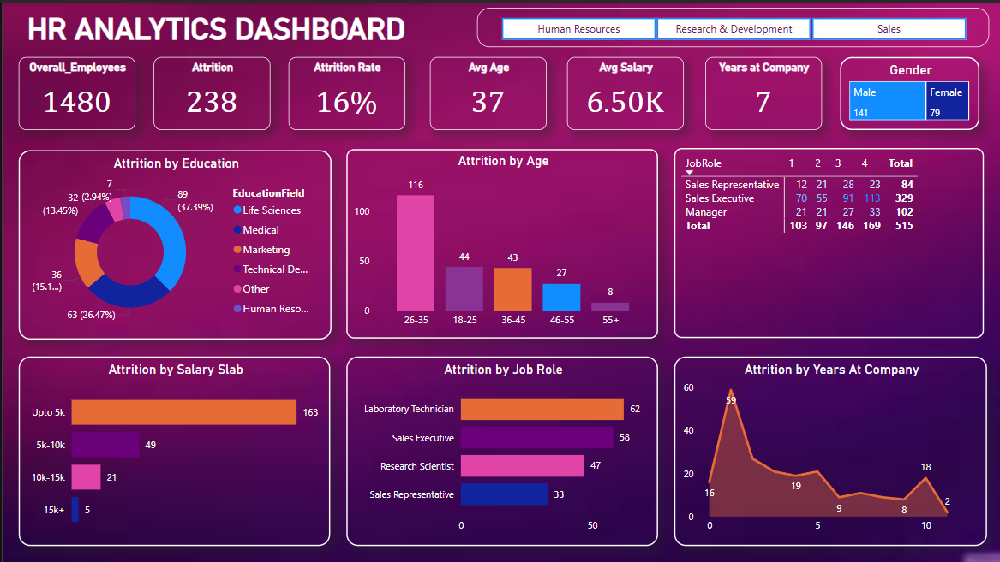

# 📊 HR Analytics Dashboard (Power BI)

Welcome to the **HR Analytics Dashboard** project! This repository provides actionable insights into employee attrition, demographics, salary distribution, and job roles, all visualized through an interactive Power BI dashboard.

---

## 🚀 Overview

- **Dashboard Preview:**  
  

- **Dataset:**  
  [Download HR_Analytics.csv](./HR_Analytics.csv)

---

## 🔍 Key Features

- **Overall Metrics:** Total employees, attrition count, attrition rate, average age, average salary, average years at company, and gender split.
- **Attrition by Education:** Donut chart showing attrition counts by education field.
- **Attrition by Age:** Bar chart displaying attrition across age groups.
- **Attrition by Salary Slab:** Highlights which salary ranges see the most attrition.
- **Attrition by Job Role:** Bar chart showing attrition by different job roles.
- **Attrition by Years at Company:** Line chart visualizing attrition based on years spent at the company.
- **Job Role Table:** Matrix showing attrition counts by job role and years at company.

---

## 📁 Dataset Structure

- **File:** [HR_Analytics.csv](./HR_Analytics.csv)
- **Columns:**
  - EmpID
  - Age
  - AgeGroup
  - Attrition
  - BusinessTravel
  - DailyRate
  - Department
  - DistanceFromHome
  - Education
  - EducationField
  - EmployeeCount
  - EmployeeNumber
  - EnvironmentSatisfaction
  - Gender
  - HourlyRate
  - JobInvolvement
  - JobLevel
  - JobRole
  - JobSatisfaction
  - MaritalStatus
  - MonthlyIncome
  - SalarySlab
  - MonthlyRate
  - NumCompaniesWorked
  - Over18
  - OverTime
  - PercentSalaryHike
  - PerformanceRating
  - RelationshipSatisfaction
  - StandardHours
  - StockOptionLevel
  - TotalWorkingYears
  - TrainingTimesLastYear
  - WorkLifeBalance
  - YearsAtCompany
  - YearsInCurrentRole
  - YearsSinceLastPromotion
  - YearsWithCurrManager

---

## 💡 Insights

- **Attrition Rate:** 16% of employees have left the company.
- **Key Attrition Segments:**  
  - Highest attrition in Life Sciences and Medical education fields.
  - Most attrition occurs in the 26–35 age group.
  - Employees with a salary up to 5k are most likely to leave.
  - Laboratory Technicians and Sales Executives have the highest attrition among job roles.
  - Attrition peaks for employees with 1 year at the company.
- **Gender Distribution:** Attrition is higher among males than females in this dataset.

---
